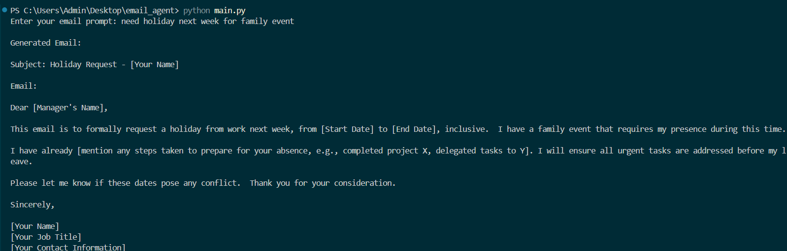

# 🧠 Intelligent Email Writer for Non-Native English Speakers

A professional, AI-powered email generation tool that helps non-native English speakers convert fragmented, informal, or incomplete prompts into clear, concise, and well-structured emails using Google's Gemini (`gemini-1.5-flash`) via LangChain.

## 📌 Project Overview

Many users struggle to write professional emails due to language limitations, unclear grammar, or lack of structure. This tool bridges that gap by:

- Interpreting short or broken English prompts
- Inferring missing context or details
- Generating a polished, formal email with a subject line

## 💡 Ideation Process

### 🧭 Problem Statement
Non-native English speakers often:
- Struggle with grammar and structure
- Write fragmented email drafts
- Use informal tone in professional settings

### 🧠 Solution
Build a lightweight, agent-style LLM system that:
1. Accepts informal/incomplete English
2. Uses Gemini LLM to infer intent
3. Generates full emails with proper structure, tone, and grammar
4. Handles missing info with polite assumptions

## 🗂️ Project Structure

### 📄 `main.py`
Entry point of the application. Takes user input and passes it to the generator function.

### 📁 `agent/`
Contains logic for LLM interaction and prompt generation.

- `email_agent.py`: Defines how the email is generated using Gemini LLM, and optionally incorporates memory.

### 📁 `memory/`
Manages session-based memory (e.g., names, tone preferences, chat history).

- `memory_store.py`: Configures LangChain's memory (e.g., `ConversationBufferMemory`) which can be expanded to retain context or user personalization across sessions.

### 📁 `utils/`
Preprocessing helpers.

- `parser.py`: Cleans up and sanitizes informal text input from the user.
---
## 🖼️ Example Output

Here is a sample email generated from an informal prompt:

